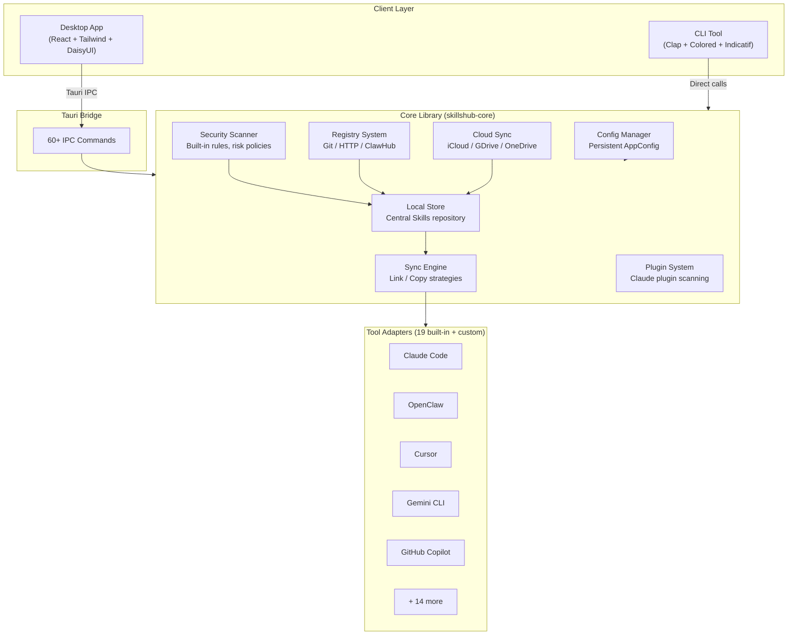

<div align="center">

# SkillsHub

**A unified Agent Skills management and sharing platform**

Install once. Sync everywhere.

[](CHANGELOG.md)
[](https://www.rust-lang.org/)
[](https://tauri.app/)
[](https://react.dev/)
[](LICENSE)

[English](README.md) | [中文](README_CN.md)

</div>

---

## What is SkillsHub?

SkillsHub is a centralized management platform for **Agent Skills** — the reusable instruction sets that enhance AI coding assistants. It lets you maintain a single collection of Skills and automatically distribute them to every AI coding tool you use.

Instead of manually copying Skill files into each tool's directory, SkillsHub acts as a central hub: install a Skill once, and it syncs to Claude Code, OpenClaw, Cursor, Gemini CLI, and 15+ other tools simultaneously.

### The Problem

AI coding tools each maintain their own Skills directory. If you use multiple tools, you end up:
- Duplicating the same Skills across `~/.claude/skills`, `~/.cursor/skills`, `~/.gemini/skills`, etc.
- Manually keeping them in sync when you update a Skill
- Having no visibility into which tools have which Skills
- Running unknown Skill code without any security review

### The Solution

SkillsHub provides:
- **One central store** for all your Skills
- **Automatic sync** to every detected tool via symlinks or file copies
- **Security scanning** before installation to detect dangerous patterns
- **A desktop app and CLI** so you can work however you prefer

## Features

### Unified Skills Management
Manage all your Skills from a single location. Install, update, uninstall, and organize Skills through an intuitive desktop GUI or a full-featured CLI.

### Multi-Tool Sync
Sync Skills to 19 built-in tool adapters with two strategies:
- **Link** (recommended) — creates symlinks; instant updates, saves disk space
- **Copy** — duplicates files; better compatibility for tools that don't support symlinks

Beyond built-in adapters, you can add **custom tools** with user-defined Skills directories, so any AI coding tool can be integrated into the sync workflow.

### Security Scanning
Every Skill is scanned before installation against a set of built-in security rules covering destructive commands, privilege escalation, data exfiltration, credential access, and more. The rule set is continuously expanding. You can configure risk-level policies (block / confirm / allow) and manage trusted sources.

### Drift Detection
SkillsHub continuously monitors sync state across all tools. When a Skill file gets modified or deleted outside of SkillsHub, drift detection flags the inconsistency and offers one-click repair.

### Multi-Registry Discovery
Search and install Skills from multiple registries (Git repositories, HTTP endpoints, ClawHub). Default registries include ClawHub, anthropics, obra, ComposioHQ, and vercel-labs. You can also add your own **custom registries** — any Git repository or HTTP endpoint can serve as a Skills source.

### Cloud Sync
Sync your Skills collection across machines via iCloud Drive, Google Drive, or OneDrive. Auto-detects installed cloud storage providers.

### Multilingual & Theming
9-language UI (English, 中文, 日本語, 한국어, Français, Deutsch, Español, Português, Русский) with Auto / Light / Dark theme modes.

## Architecture



## Supported Tools

| Tool | Skills Path | Status |
|------|------------|--------|
| Claude Code | `~/.claude/skills` | Supported ✅ |
| OpenClaw | `~/.openclaw/workspace/skills` | Supported ✅ |
| Cursor | `~/.cursor/skills` | Supported ✅ |
| Gemini CLI | `~/.gemini/skills` | Supported ✅ |
| GitHub Copilot | `~/.copilot/skills` | Supported ✅ |
| Amp | `~/.config/agents/skills` | Supported ✅ |
| Antigravity | `~/.gemini/antigravity/skills` | Supported ✅ |
| CodeBuddy | `~/.codebuddy/skills` | Supported ✅ |
| Codex | `~/.codex/skills` | Supported ✅ |
| Droid / Factory | `~/.factory/skills` | Supported ✅ |
| Goose | `~/.config/goose/skills` | Supported ✅ |
| Kilo Code | `~/.kilocode/skills` | Supported ✅ |
| Kimi CLI | `~/.kimi/skills` | Supported ✅ |
| OpenCode | `~/.config/opencode/skills` | Supported ✅ |
| Qwen Code | `~/.qwen/skills` | Supported ✅ |
| Roo Code | `~/.roo/skills` | Supported ✅ |
| Trae | `.trae/skills` | Supported ✅ |
| Windsurf | `~/.codeium/windsurf/skills` | Supported ✅ |
| Custom Tools | User-defined paths | Supported ✅ |

## Installation

### Pre-built Binaries (Recommended)

Download the latest release for your platform from the [Releases](https://github.com/shiwenwen/SkillsHub/releases) page.

| Platform | Desktop App | CLI |
|----------|------------|-----|
| macOS (Apple Silicon) | `SkillsHub_x.x.x_aarch64.dmg` | `skillshub-cli-aarch64-apple-darwin` |
| macOS (Intel) | `SkillsHub_x.x.x_x64.dmg` | `skillshub-cli-x86_64-apple-darwin` |
| Windows | `SkillsHub_x.x.x_x64-setup.exe` | `skillshub-cli-x86_64-pc-windows-msvc.exe` |
| Linux (deb) | `skillshub_x.x.x_amd64.deb` | `skillshub-cli-x86_64-unknown-linux-gnu` |
| Linux (AppImage) | `SkillsHub_x.x.x_amd64.AppImage` | — |

#### macOS

```bash
# Install the desktop app
# Download and open the .dmg file, drag SkillsHub to Applications

# Or install the CLI only
curl -L -o skillshub https://github.com/shiwenwen/SkillsHub/releases/latest/download/skillshub-cli-aarch64-apple-darwin
chmod +x skillshub
sudo mv skillshub /usr/local/bin/
```

#### Windows

Download and run the `.exe` installer. The CLI can be added to your PATH manually.

#### Linux

```bash
# Debian / Ubuntu
sudo dpkg -i skillshub_x.x.x_amd64.deb

# Or use the AppImage
chmod +x SkillsHub_x.x.x_amd64.AppImage
./SkillsHub_x.x.x_amd64.AppImage

# CLI only
curl -L -o skillshub https://github.com/shiwenwen/SkillsHub/releases/latest/download/skillshub-cli-x86_64-unknown-linux-gnu
chmod +x skillshub
sudo mv skillshub /usr/local/bin/
```

### Build from Source

See the [Local Development](#local-development) section below.

## Quick Start

### Desktop App

1. Launch SkillsHub — the **Installed** page shows your current Skills
2. Go to **Discover** to search and install Skills from registries
3. Check **Sync Dashboard** for sync status and drift detection
4. Use **Security Center** to scan Skills and configure trust policies
5. Configure tool paths, registries, and cloud sync in **Settings**

### CLI

```bash
# Detect which AI coding tools are installed
skillshub tools detect

# Search for Skills
skillshub discover "code review"

# Install a Skill (auto-syncs to all detected tools)
skillshub install my-skill

# Sync all Skills to all tools
skillshub sync

# List installed Skills
skillshub list

# Run a security scan
skillshub scan my-skill

# Manage registries
skillshub registry list
skillshub registry add my-registry --url https://github.com/org/skills-repo.git
```

## Security Scanning Rules

SkillsHub includes a growing set of built-in security rules. Current rules:

| Rule ID | Description | Risk Level |
|---------|------------|------------|
| CMD001 | Destructive commands (`rm -rf`, etc.) | HIGH |
| CMD002 | Privilege escalation (`sudo`, etc.) | HIGH |
| NET001 | Data exfiltration (outbound network calls with sensitive data) | HIGH |
| CRED001 | Credential access (reading keys, tokens, passwords) | HIGH |
| EVAL001 | Dynamic code execution (`eval`, `exec`, etc.) | MEDIUM |
| PATH001 | System path access (`/etc`, `/usr`, etc.) | MEDIUM |
| FILE001 | Binary executables | BLOCK |
| FILE002 | Shell scripts | MEDIUM |

More rules will be added in future releases.

## Local Development

### Prerequisites

- [Rust](https://rustup.rs/) 1.70+
- [Node.js](https://nodejs.org/) 18+
- npm (bundled with Node.js) or [pnpm](https://pnpm.io/)
- Platform-specific dependencies for Tauri — see [Tauri Prerequisites](https://v2.tauri.app/start/prerequisites/)

### Setup

```bash
# Clone the repository
git clone https://github.com/shiwenwen/SkillsHub.git
cd SkillsHub

# Install frontend dependencies
npm install

# Run the desktop app in development mode (hot-reload enabled)
npm run tauri dev

# Build the desktop app for production
npm run tauri build

# Build the CLI only
cargo build --release --package skillshub-cli

# Run tests
cargo test --workspace
```

### Project Structure

```
SkillsHub/
├── crates/
│   ├── skillshub-core/          # Core library (shared by desktop app and CLI)
│   │   └── src/
│   │       ├── adapters/        # 19 tool adapters
│   │       ├── models/          # Data models (Skill, Tool, SyncState, ScanReport)
│   │       ├── store.rs         # Local Skills storage
│   │       ├── sync.rs          # Sync engine (Link / Copy)
│   │       ├── scanner.rs       # Security scanner
│   │       ├── registry.rs      # Registry providers
│   │       ├── cloud_sync.rs    # Cloud sync integration
│   │       ├── plugins.rs       # Claude plugin support
│   │       ├── config.rs        # Configuration management
│   │       └── update.rs        # Update checker
│   └── skillshub-cli/           # CLI tool
│       └── src/
│           ├── main.rs
│           └── commands/        # CLI command handlers
├── src/                         # React frontend
│   ├── pages/                   # Page components
│   ├── components/              # Shared UI components
│   ├── locales/                 # 9 language files
│   ├── i18n.tsx                 # Internationalization context
│   ├── theme.tsx                # Theme context
│   └── App.tsx                  # Router and app shell
├── src-tauri/                   # Tauri backend
│   └── src/
│       ├── commands.rs          # 60+ IPC command handlers
│       └── lib.rs               # Tauri app setup
├── Cargo.toml                   # Rust workspace configuration
├── package.json                 # Node.js dependencies
├── tailwind.config.js           # Tailwind CSS + DaisyUI themes
└── vite.config.ts               # Vite build configuration
```

### Tech Stack

| Layer | Technology |
|-------|-----------|
| Desktop Framework | Tauri 2.2 |
| Frontend | React 18, TypeScript 5.5, Tailwind CSS 3.4, DaisyUI 4 |
| Build Tool | Vite 5.4 |
| Backend Language | Rust (2021 edition) |
| Async Runtime | Tokio |
| CLI Framework | Clap 4.5 |
| HTTP Client | Reqwest 0.12 |
| Icons | Lucide React |

## Contributing

Contributions are welcome. See [CONTRIBUTING.md](CONTRIBUTING.md) for guidelines.

## License

[MIT License](LICENSE)
