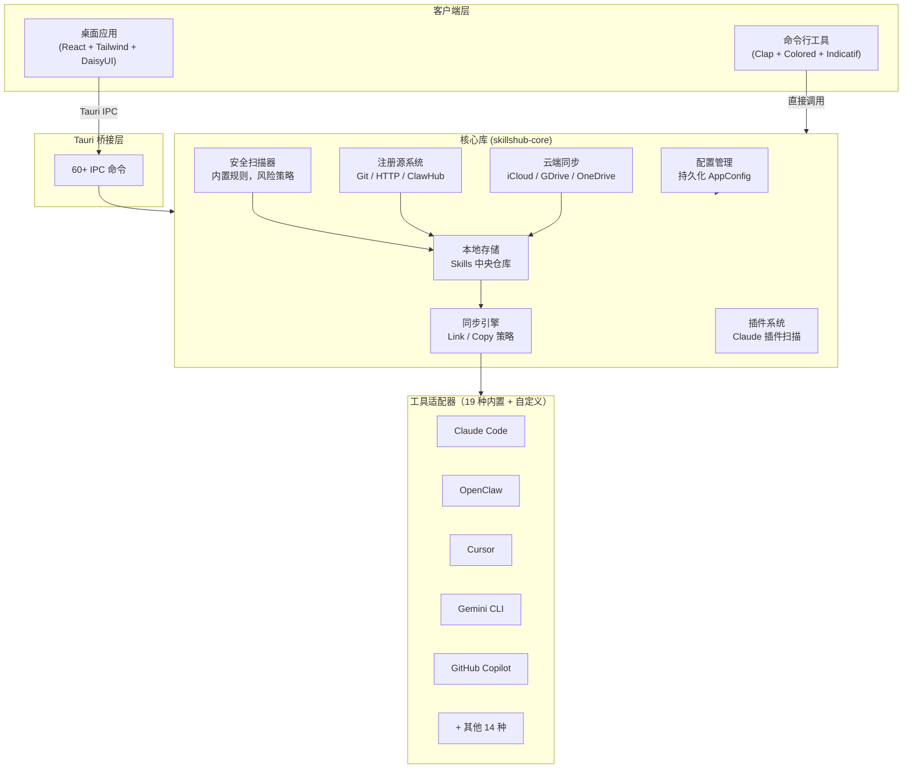

<div align="center">

# SkillsHub

**统一的 Agent Skills 管理与共享平台**

🖥️ 跨平台桌面应用 — 一次安装，处处同步。

[](CHANGELOG.md)
[](https://github.com/shiwenwen/SkillsHub/releases)
[](https://github.com/shiwenwen/SkillsHub/releases)
[](https://github.com/shiwenwen/SkillsHub/releases)
[](https://www.rust-lang.org/)
[](https://tauri.app/)
[](https://react.dev/)
[](LICENSE)

[English](README.md) | [中文](README_CN.md)

</div>

---

## SkillsHub 是什么？

SkillsHub 是一个集中式的 **Agent Skills** 管理平台。Skills 是增强 AI 编码助手能力的可复用指令集，SkillsHub 让你只需维护一份 Skills 集合，即可自动分发到你使用的所有 AI 编码工具。

无需手动将 Skill 文件逐一复制到每个工具的目录中。SkillsHub 充当中央仓库：安装一次 Skill，它会同时同步到 Claude Code、OpenClaw、Cursor、Gemini CLI 等 15+ 工具。

### 痛点

AI 编码工具各自维护独立的 Skills 目录。如果你使用多个工具，就会面临：

- 在 `~/.claude/skills`、`~/.cursor/skills`、`~/.gemini/skills` 等目录间重复复制相同的 Skills
- 更新 Skill 时需要手动保持各处同步
- 无法直观了解哪些工具拥有哪些 Skills
- 运行未经安全审查的未知 Skill 代码

### 解决方案

SkillsHub 提供：

- **统一存储** — 所有 Skills 的中央仓库
- **自动同步** — 通过符号链接或文件复制自动分发到每个检测到的工具
- **安全扫描** — 安装前检测危险模式
- **桌面应用 + 命令行** — 满足不同使用习惯

## 功能特性

### 统一 Skills 管理

在一个地方管理所有 Skills。通过直观的桌面 GUI 或功能完整的 CLI 进行安装、更新、卸载和组织。

### 多工具同步

支持 19 种内置工具适配器，提供两种同步策略：

- **Link（推荐）** — 创建符号链接；即时更新，节省磁盘空间
- **Copy** — 复制完整文件；兼容性更好，适用于不支持符号链接的工具

除内置适配器外，还支持添加**自定义工具**并配置自定义 Skills 目录，让任何 AI 编码工具都能纳入同步工作流。

### 安全扫描

每个 Skill 在安装前都会经过一组内置安全规则扫描，覆盖破坏性命令、权限提升、数据外泄、凭据访问等风险。规则集持续扩展中。支持配置风险级别策略（阻止 / 确认 / 允许）和管理可信来源。

### 漂移检测

SkillsHub 持续监控所有工具的同步状态。当 Skill 文件在 SkillsHub 之外被修改或删除时，漂移检测会标记不一致并提供一键修复。

### 多注册源发现

从多个注册源（Git 仓库、HTTP 端点、ClawHub）搜索和安装 Skills。默认注册源包括 ClawHub、anthropics、obra、ComposioHQ 和 vercel-labs。同时支持添加**自定义注册源** — 任何 Git 仓库或 HTTP 端点都可以作为 Skills 来源。

### 云端同步

通过 iCloud Drive、Google Drive 或 OneDrive 在多台设备间同步 Skills 集合。自动检测已安装的云存储服务。

### 多语言与主题

9 语言 UI（English、中文、日本語、한국어、Français、Deutsch、Español、Português、Русский），支持自动 / 亮色 / 暗色主题模式。

## 支持的工具

| 工具            | Skills 路径                    | 状态      |
| --------------- | ------------------------------ | --------- |
| Claude Code     | `~/.claude/skills`             | 已支持 ✅ |
| OpenClaw        | `~/.openclaw/workspace/skills` | 已支持 ✅ |
| Cursor          | `~/.cursor/skills`             | 已支持 ✅ |
| Gemini CLI      | `~/.gemini/skills`             | 已支持 ✅ |
| GitHub Copilot  | `~/.copilot/skills`            | 已支持 ✅ |
| Amp             | `~/.config/agents/skills`      | 已支持 ✅ |
| Antigravity     | `~/.gemini/antigravity/skills` | 已支持 ✅ |
| CodeBuddy       | `~/.codebuddy/skills`          | 已支持 ✅ |
| Codex           | `~/.codex/skills`              | 已支持 ✅ |
| Droid / Factory | `~/.factory/skills`            | 已支持 ✅ |
| Goose           | `~/.config/goose/skills`       | 已支持 ✅ |
| Kilo Code       | `~/.kilocode/skills`           | 已支持 ✅ |
| Kimi CLI        | `~/.kimi/skills`               | 已支持 ✅ |
| OpenCode        | `~/.config/opencode/skills`    | 已支持 ✅ |
| Qwen Code       | `~/.qwen/skills`               | 已支持 ✅ |
| Roo Code        | `~/.roo/skills`                | 已支持 ✅ |
| Trae            | `.trae/skills`                 | 已支持 ✅ |
| Windsurf        | `~/.codeium/windsurf/skills`   | 已支持 ✅ |
| 自定义工具      | 用户自定义路径                 | 已支持 ✅ |

## 架构



## 安装

SkillsHub 支持 **macOS**（Apple Silicon 和 Intel）、**Windows**（x64）和 **Linux**（x64）。

### 预编译安装包（推荐）

从 [Releases](https://github.com/shiwenwen/SkillsHub/releases) 页面下载对应平台的最新版本。

#### macOS

```bash
# 安装桌面应用
# 下载 .dmg 文件，打开后将 SkillsHub 拖入 Applications 文件夹

# 或仅安装 CLI
curl -L -o skillshub https://github.com/shiwenwen/SkillsHub/releases/latest/download/skillshub-cli-aarch64-apple-darwin
chmod +x skillshub
sudo mv skillshub /usr/local/bin/
```

#### Windows

下载并运行 `.exe` 安装程序。CLI 可手动添加到系统 PATH。

#### Linux

```bash
# Debian / Ubuntu
sudo dpkg -i skillshub_x.x.x_amd64.deb

# 或使用 AppImage
chmod +x SkillsHub_x.x.x_amd64.AppImage
./SkillsHub_x.x.x_amd64.AppImage

# 仅安装 CLI
curl -L -o skillshub https://github.com/shiwenwen/SkillsHub/releases/latest/download/skillshub-cli-x86_64-unknown-linux-gnu
chmod +x skillshub
sudo mv skillshub /usr/local/bin/
```

### 从源码构建

参见下方[本地开发](#本地开发)部分。

## 快速开始

### 桌面应用

1. 启动 SkillsHub — **Installed** 页面显示已安装的 Skills
2. 进入 **Discover** 页面，从注册源搜索和安装 Skills
3. 在 **Sync Dashboard** 查看同步状态和漂移检测
4. 使用 **Security Center** 扫描 Skills 并配置信任策略
5. 在 **Settings** 中配置工具路径、注册源和云端同步

### 命令行

```bash
# 检测已安装的 AI 编码工具
skillshub tools detect

# 搜索 Skills
skillshub discover "code review"

# 安装 Skill（自动同步到所有检测到的工具）
skillshub install my-skill

# 同步所有 Skills 到所有工具
skillshub sync

# 列出已安装的 Skills
skillshub list

# 运行安全扫描
skillshub scan my-skill

# 管理注册源
skillshub registry list
skillshub registry add my-registry --url https://github.com/org/skills-repo.git
```

## 安全扫描规则

SkillsHub 内置了一组持续扩展的安全规则。当前规则：

| 规则 ID | 描述                                   | 风险等级 |
| ------- | -------------------------------------- | -------- |
| CMD001  | 破坏性命令（`rm -rf` 等）              | HIGH     |
| CMD002  | 权限提升（`sudo` 等）                  | HIGH     |
| NET001  | 数据外泄（携带敏感数据的出站网络请求） | HIGH     |
| CRED001 | 凭据访问（读取密钥、令牌、密码）       | HIGH     |
| EVAL001 | 动态代码执行（`eval`、`exec` 等）      | MEDIUM   |
| PATH001 | 系统路径访问（`/etc`、`/usr` 等）      | MEDIUM   |
| FILE001 | 二进制可执行文件                       | BLOCK    |
| FILE002 | Shell 脚本                             | MEDIUM   |

更多规则将在后续版本中持续添加。

## 本地开发

### 前置要求

- [Rust](https://rustup.rs/) 1.70+
- [Node.js](https://nodejs.org/) 18+
- npm（随 Node.js 捆绑）或 [pnpm](https://pnpm.io/)
- Tauri 平台依赖 — 参见 [Tauri 前置要求](https://v2.tauri.app/start/prerequisites/)

### 开发环境搭建

```bash
# 克隆仓库
git clone https://github.com/shiwenwen/SkillsHub.git
cd SkillsHub

# 安装前端依赖
npm install

# 以开发模式运行桌面应用（支持热重载）
npm run tauri dev

# 构建生产版本桌面应用
npm run tauri build

# 仅构建 CLI
cargo build --release --package skillshub-cli

# 运行测试
cargo test --workspace
```

### 项目结构

```
SkillsHub/
├── crates/
│   ├── skillshub-core/          # 核心库（桌面应用和 CLI 共用）
│   │   └── src/
│   │       ├── adapters/        # 19 种工具适配器
│   │       ├── models/          # 数据模型（Skill、Tool、SyncState、ScanReport）
│   │       ├── store.rs         # 本地 Skills 存储
│   │       ├── sync.rs          # 同步引擎（Link / Copy）
│   │       ├── scanner.rs       # 安全扫描器
│   │       ├── registry.rs      # 注册源提供者
│   │       ├── cloud_sync.rs    # 云端同步集成
│   │       ├── plugins.rs       # Claude 插件支持
│   │       ├── config.rs        # 配置管理
│   │       └── update.rs        # 更新检查器
│   └── skillshub-cli/           # CLI 工具
│       └── src/
│           ├── main.rs
│           └── commands/        # CLI 命令处理器
├── src/                         # React 前端
│   ├── pages/                   # 页面组件
│   ├── components/              # 共享 UI 组件
│   ├── locales/                 # 9 种语言文件
│   ├── i18n.tsx                 # 国际化上下文
│   ├── theme.tsx                # 主题上下文
│   └── App.tsx                  # 路由和应用外壳
├── src-tauri/                   # Tauri 后端
│   └── src/
│       ├── commands.rs          # 60+ IPC 命令处理器
│       └── lib.rs               # Tauri 应用初始化
├── Cargo.toml                   # Rust 工作空间配置
├── package.json                 # Node.js 依赖
├── tailwind.config.js           # Tailwind CSS + DaisyUI 主题
└── vite.config.ts               # Vite 构建配置
```

### 技术栈

| 层级        | 技术                                                  |
| ----------- | ----------------------------------------------------- |
| 桌面框架    | Tauri 2.2                                             |
| 前端        | React 18、TypeScript 5.5、Tailwind CSS 3.4、DaisyUI 4 |
| 构建工具    | Vite 5.4                                              |
| 后端语言    | Rust（2021 edition）                                  |
| 异步运行时  | Tokio                                                 |
| CLI 框架    | Clap 4.5                                              |
| HTTP 客户端 | Reqwest 0.12                                          |
| 图标库      | Lucide React                                          |

## 参与贡献

欢迎贡献！请查看 [CONTRIBUTING.md](CONTRIBUTING.md) 了解贡献指南。

## 许可证

[MIT License](LICENSE)
